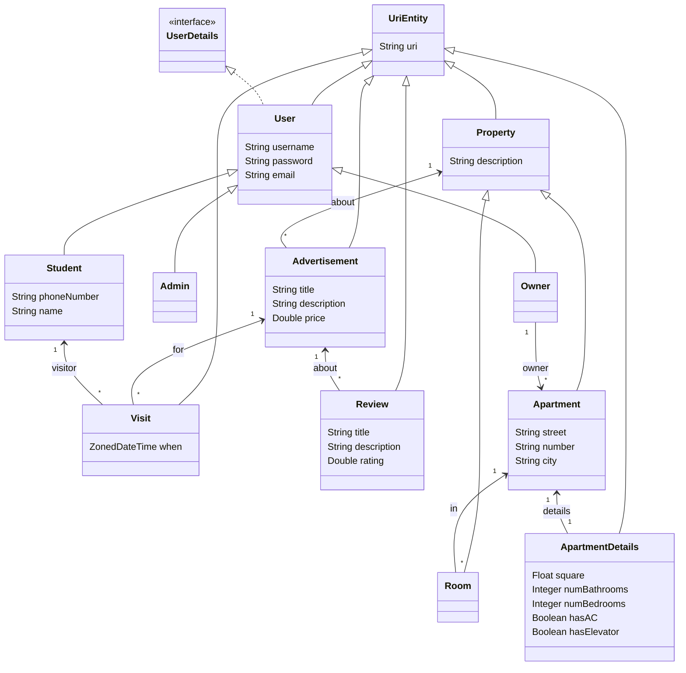

# MyApartments API

Spring Boot project including Spring REST, HATEOAS, JPA, etc. Additional details: [HELP.md](HELP.md)

## Vision

**For** ... **who** want to ...
**the project** ... **is an** ...
**that** allows ...
**Unlike** other ...

## Features per Stakeholder

| USER             | ADMIN                         | STUDENT              | OWNER                          |
|------------------|-------------------------------|----------------------|--------------------------------|
| Register Student | Delete advertisements         | List Advertisements  | Register Apartment (and rooms) |
| Register Owner   | Block user                    | Find Advertisement   | Publish Advertisement          |
| Login            | Delete User                   | Request Visit        | List Owned Apartments          |
| Logout           |                               | Filter advertisement | List Own Advertisements        |
| View profile     |                               | Cancel Visit         | Accept Visit                   |
| Edit profile     |                               | Review Advertisement | Reject Visit                   |
|                  |                               | View Visit Status    |                                |

## Entities Model

